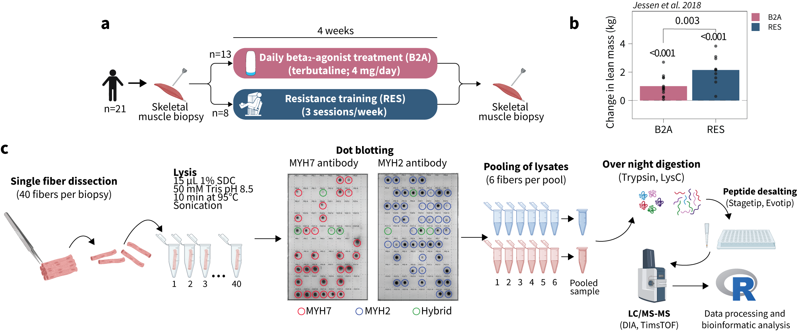
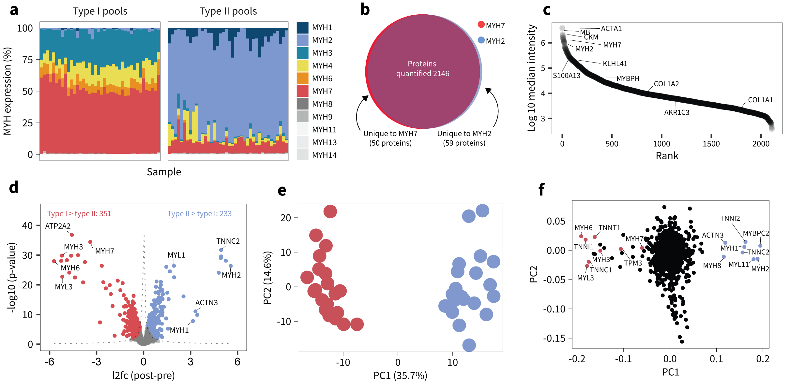
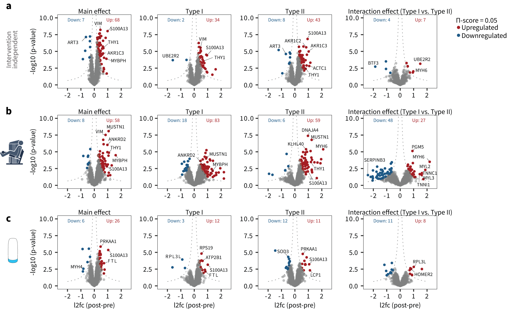
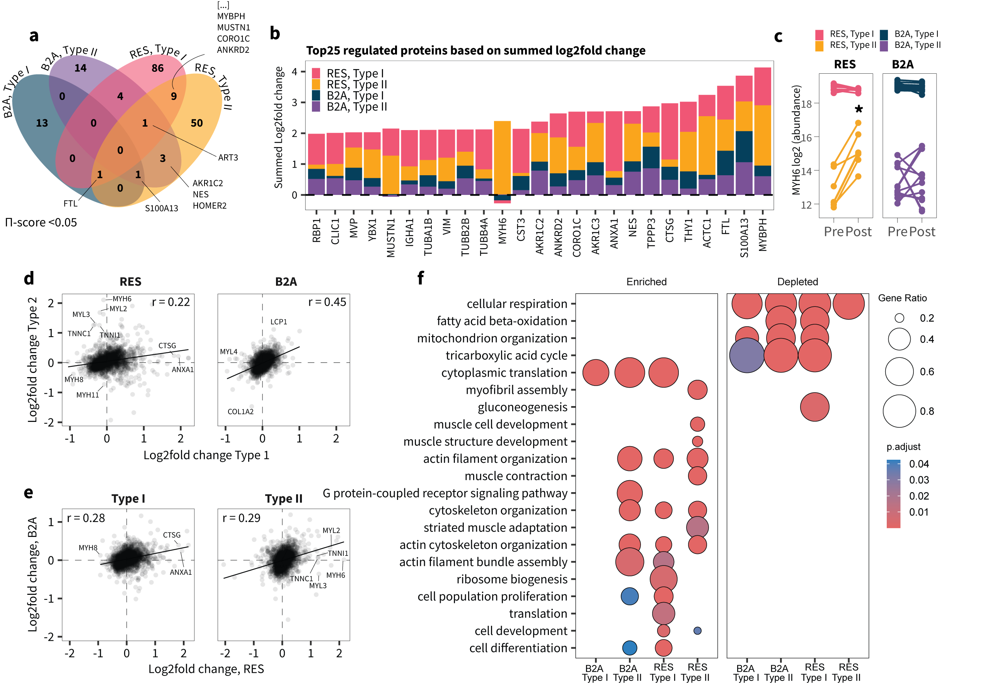
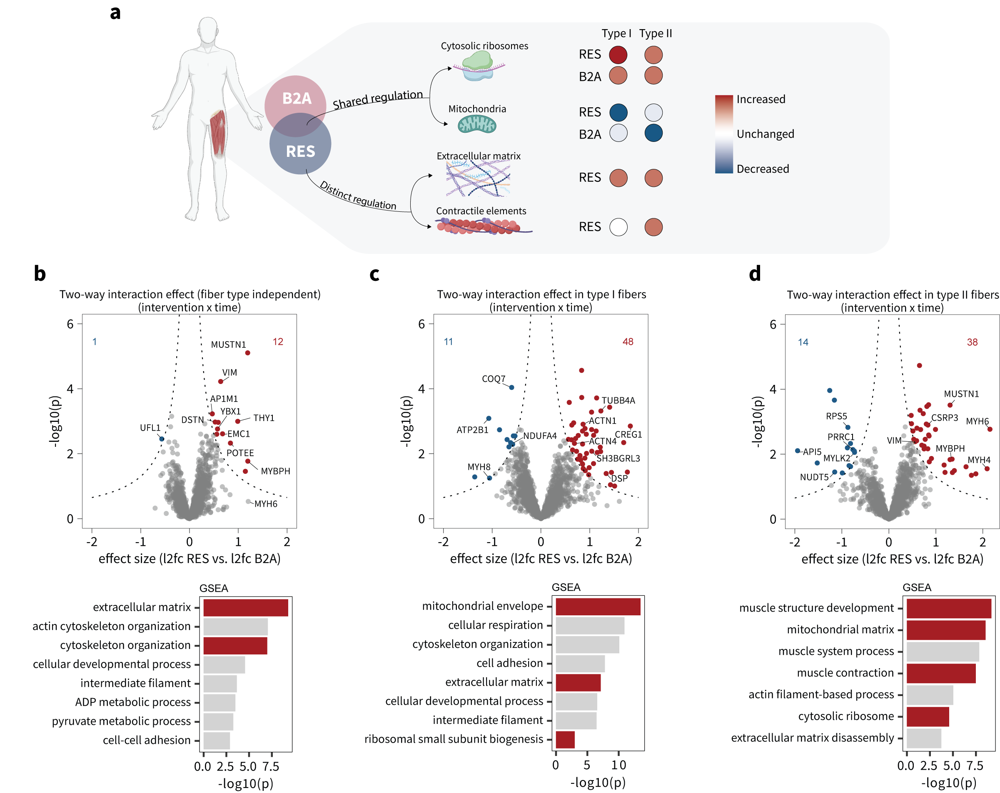
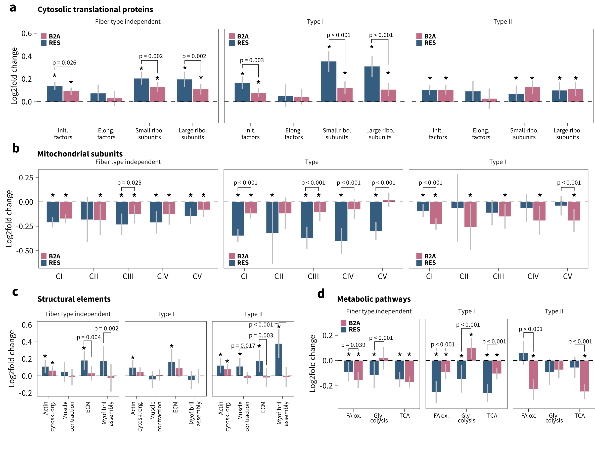
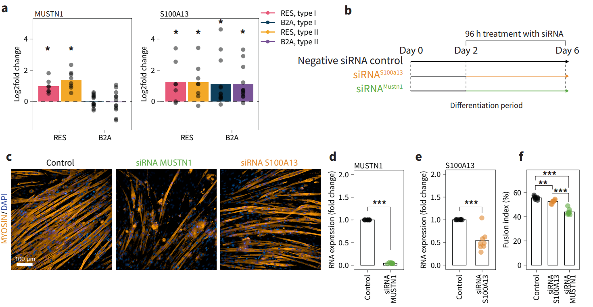

# Proteomics Analysis: β2-Agonist and Resistance Training (single skeletal muscle fibers)

This repository contains the code and data to reproduce the analysis from an unpublished study on β2-agonist treatment combined with resistance training and their effects on the skeletal muscle proteome in
type I and IIa muscle fibers, respectively.

# Project Setup

This project uses [`renv`](https://rstudio.github.io/renv/) to manage R package dependencies in a fully self-contained way.

##Installation Steps

1. **Clone the repository**
   ```bash
   git clone https://github.com/s-jessen/manuscript_single_fiber.git
   cd manuscript_beta2agonist_resistance_training
   ```

2. **Install packages and set up environment**

You can either run the setup file in a terminal:
  ```bash
  Rscript setup.R
  ```

Or open setup.R in RStudio and run it interactively.
  
# Folder Structure
```
TBA
```

The R project contains code to reproduce the following highlighted figures:








